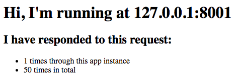

# stateful-k8s-app

A containerised stateful application for use in the Kubernetes for Cloud Foundry course.

It has been pushed to Dockerhub and can be pulled at [engineerbetter/stateful-app](https://hub.docker.com/r/engineerbetter/stateful-app).



## Usage

### Without Redis

When deployed without a Redis, the `stateful-app` utilises Sinatra's `sessions`, storing information in the app's memory.

### With Redis

When deployed to a Kubernetes Cluster where a Redis instance can be detected, the application, upon starting, will use the Redis to store state.

How does this work you ask? When and service is deployed to a Kubernetes cluster, a series of [environment variables](https://kubernetes.io/docs/concepts/services-networking/service/#discovering-services) are set to enable service discovery. The `stateful-app` uses one of these (REDIS_MASTER_SERVICE_HOST) to determine whether to use a deployed Redis.

### Running Locally

```sh
$ git clone git@github.com:EngineerBetter/stateful-k8s-app.git
$ rackup
```

Visit the application at localhost:9292

### Running on Docker

```sh
$ git clone git@github.com:EngineerBetter/stateful-k8s-app.git
$ docker build -t engineerbetter/stateful-app .

# Get the image of the recently build image
$ docker images

# Run the image
$ docker run <IMAGE ID>
```

Visit the app at 0.0.0.0:9292
